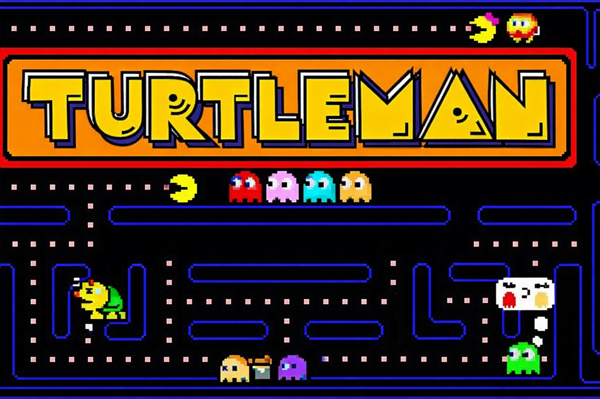

# Team Introduction
### **Sean Vellequette - hogintosh**

I'm a graduate student in Robotics and Autonomous Systems at Arizona State University with a background in mechatronics, robotics, embedded systems, and intelligent manufacturing.

My work focuses on building autonomous systems that integrate perception, control, and machine learning. I enjoy developing both simulation and real-world robotic platforms, including mobile robots, computer vision pipelines, and sensor-driven hardware systems.

My interests include:
- Autonomous robotics and navigation
- Robot perception and computer vision
- AI for manufacturing and additive manufacturing
- Embedded systems and hardware prototyping
- Control systems and optimal control

Many of my projects combine software and hardware, including ROS2 robots, robotic manipulation systems, and machine learning pipelines

### **Gabriel Sandys - GSandys7**

Robotics and Autonomous Systems (Concentration Systems Engineering) (Masters)

### **Abdirahman Aden - abdiaden3333**

I am a graduate student in Robotics and Autonomous Systems at Arizona State University with a background in automation, computer vision, and hardware integration. 

My work focuses on building intelligent robotic systems that combine computer vision, embedded systems, and real-time robot control.I enjoy building robotics systems that combine computer vision, machine learning, and automation to solve real-world problems

interests:
- Robotics and automation systems
- Computer vision for robotic perception
- Vision-guided manipulation and tracking
- Embedded systems and sensor integration
- Intelligent robotic systems for manufacturing and automation
  
I primarily work with Python, ROS2, MATLAB, computer vision frameworks such as OpenCV and YOLO, and embedded systems for sensor integration and robotic platforms. My goal is to develop intelligent robotic systems that improve automation and enable more capable real-world robotics applications.

## This is the home page!

This is a *bare-minimum* template to create a Jekyll site that uses the [Just the Docs] theme. You can easily set the created site to be published on [GitHub Pages] – the [README] file explains how to do that, along with other details.

