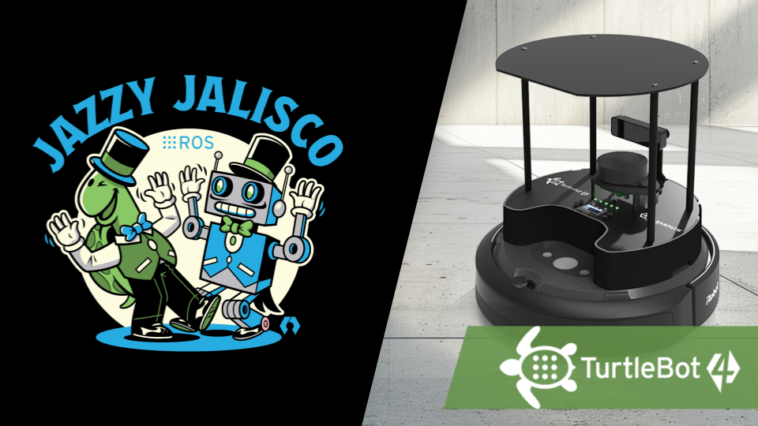

# Report 3: ZZ

{: .no_toc }

This page demonstrates the core capabilities of the Just the Docs theme, including navigation, mathematical typesetting, and technical diagrams.

---

## Table of Contents

{: .no_toc .text-delta }

1. TOC
{:toc}

---

## 1.Graphical Abstract
The probability density function of a Gaussian distribution is defined as:

$$p(x) = \frac{1}{\sigma\sqrt{2\pi}} e^{-\frac{1}{2}\left(\frac{x-\mu}{\sigma}\right)^2}$$

Where:
- $$\mu$$ is the mean (peak location).
- $$\sigma$$ is the standard deviation (width of the "bell").

---

## 2.Algorithm:

Below is a snippet of the Python code used to process the assignment data.

```python
import numpy as np

def calculate_velocity(displacement, time):
    """Calculates average velocity."""
    return np.divide(displacement, time)

print(f"Result: {calculate_velocity(100, 20)} m/s")

```

---

## 3. Benchmarking & Results

The sidebar will automatically highlight the section you are currently viewing.

### 3.1 Observations of Pacman Success 
We wanted to evaluate the rate of success of the first round of the Pacman game under round 1 conditions. This data was a simple log of how many pellets were collected for each trial. This was to evaluate the escape and pathing behavior of pacman for 1 Ghost (Clyde).


### 3.2 Conclusion
Under the baseline conditions for Clydes speed (0.25m/s), which is initialized for round 1, Pacman was able to complete the first round 30% of the time. However this rate of success can be improved given the qualitative notes that were taken during these trials. 30% of the trials only collected 7 pellets as the final pellet was located very far away from the robots starting position. Additionally, it seems like the last pellet was located in an area of the house that could easily be "Puppy Guarded" by Clyde. An image below shows this foul play.


This made the reliability of the custom Ghost-Aware path planning algorithm faulty. However if we exclude the last pellet collection, the path planning success rate jumps to 60%.

---

## 4.Ethical Impact Statement

### Privacy and Data Handling
PacManBot uses ROS 2 topics, localization data, map files, and logged robot data to operate and evaluate performance. In this implementation, the main privacy concern is not facial recognition, but the storage of indoor environment information through maps, AMCL pose logs, trajectory logs, and demo recordings. The map used for navigation may reveal the layout of an indoor space, and ROS logs may record where the TurtleBot 4 moved during testing. Future versions that add cameras or cloud connectivity would increase privacy risk and should include data minimization, local-only processing, restricted access to logs, and blurring/anonymization for any recorded video.

### Bias and Hardware Limitations
PacManBot depends heavily on TurtleBot 4 localization, LiDAR sensing, maps, and Nav2 navigation. This creates hardware-related bias because the robot may perform well in clear, mapped environments but poorly around glass, reflective surfaces, clutter, narrow passages, or areas where LiDAR returns are unreliable. AMCL localization may also become inaccurate if the map does not match the real environment. This means the robot’s performance is not equally reliable in all spaces.

### Safety and Kinetic Energy Management
PacManBot moves autonomously using the TurtleBot 4 platform, ROS 2 Nav2, AMCL localization, and goal commands from the planner node. The main safety risk is unintended robot motion, such as navigating toward an incorrect pellet goal, localization drift, delayed stopping, or collision with walls, objects, or nearby users. The package also includes event-based motion in game_event_mapper.py, such as spinning or shaking during start/death events, so these motions should remain slow and time-limited.
 The project primarily relies on TurtleBot 4 navigation and Nav2 path planning to generate controlled robot movement rather than directly commanding unrestricted motion. The system sends navigation goals through ROS 2 action interfaces, allowing the Nav2 stack to manage path execution and obstacle-aware navigation. Additionally, custom game-event motion behaviors were designed with safety considerations in mind, avoiding forward linear motion during spin and animation sequences to reduce the likelihood of unintended impacts with nearby objects or users. Stop commands are also published during reset and shutdown operations to ensure the robot safely halts movement when behaviors complete.

### Bias and Hardware Limitations
PacManBot depends heavily on TurtleBot 4 localization, LiDAR sensing, maps, and Nav2 navigation. This creates hardware-related bias because the robot may perform well in clear, mapped environments but poorly around glass, reflective surfaces, clutter, narrow passages, or areas where LiDAR returns are unreliable. AMCL localization may also become inaccurate if the map does not match the real environment. This means the robot’s performance is not equally reliable in all spaces.

### Utilitarian Test
From a utilitarian perspective, PacManBot is ethically justified because it provides educational value in ROS 2, Nav2, localization, autonomous planning, and human-robot interaction. However, these benefits only outweigh the risks if the system is tested safely, robot speed is controlled, and collected data is handled responsibly. In the scenario where there is no oversight with testing, it would fail the utilitarian test since the potential exposure of people/places would be detrimental.

### Justice Test
From a justice perspective, the robot should operate reliably across different indoor environments. Since LiDAR, AMCL, and maps can fail under certain conditions, the system may be less reliable in spaces with glass, reflective objects, or poor map quality. Future work should improve robustness through better testing, sensor fusion, and clearer documentation of limitations. Based on the potential inconsistency in certain environmental conditions, it would mostly fail this test.

### Virtue Test
From a virtue ethics perspective, the engineers should be honest about what the robot can and cannot do. For this project, that means clearly reporting Nav2 failures, localization drift, pellet-planning limitations, and safety risks instead of overstating performance. Responsible engineers should prioritize safe testing, transparent results, and continuous improvement. Since testing used LiDAR obstacle detection, reactive navigation, controlled robot movement, and indoor testing, it would pass the virtue test.


You can include images by placing them in the `assets/images/` folder.

{: width="500" }

*Figure 1: Class Logo*

---

## 5. Custom Module Code Links

* [x] Complete Markdown documentation
* [x] Verify LaTeX rendering
* [x] Generate Mermaid flowchart
* [ ] Peer review feedback

# Markdown Features

## Callouts
> This is a note
{: .note }

> This is a warning
{: .warning }

## Buttons
[Main Button](assignment1.html){: .btn .btn-primary }
[Blue Button](assignment2.html){: .btn .btn-blue }
[Blue Button](assignment3.html){: .btn .btn-red }

## Tables

| Header | Header |
| :--- | :--- |
| Cell | Cell |

---
